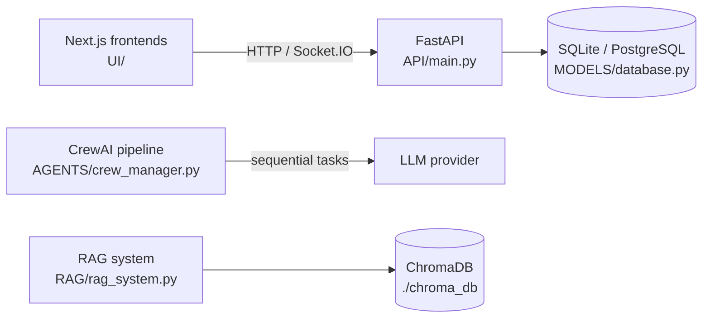

# Enhanced Agentic AI SDLC System

A software development lifecycle (SDLC) management platform that pairs a FastAPI project/task/document API with a CrewAI multi-agent pipeline and a ChromaDB retrieval layer.

## Overview

This repository contains the consolidated core of an SDLC automation system built incrementally across seven development batches, plus the design documents, configuration, and frontend components produced along the way. The core (at the repository root) provides:

- a REST API for projects, tasks, documents, and agent records (`API/`, `MODELS/`),
- a four-agent CrewAI crew that turns a project description into plan, implementation, test, and documentation outputs (`AGENTS/`),
- a persistent vector store with embedding-based semantic search over project knowledge (`RAG/`),
- utilities for config loading, file inventory, and Python syntax validation (`UTILS/`).

It is aimed at engineering teams that want a self-hosted starting point for agent-assisted SDLC tooling rather than a turnkey product: the API, crew, and RAG modules are functional in isolation, and wiring them together is the intended next step (see [Extending this system](DOCS/architecture.md#extending-this-system)).

## Architecture at a glance

- **Orchestration pattern**: sequential multi-agent pipeline. `AGENTS/crew_manager.py` composes a CrewAI `Crew` of four role-specialized agents (Project Manager, Developer, QA Engineer, Technical Writer) with four tasks executed in order under CrewAI's default sequential process. Delegation between agents is disabled (`allow_delegation=False`), so there is no supervisor routing — each task runs to completion before the next starts.
- **Models / frameworks**: CrewAI for agent orchestration (LLM provider supplied via environment; `.env.example` defaults to `gpt-4`), FastAPI + SQLAlchemy + Pydantic for the API, sentence-transformers for embeddings.
- **Memory / session state**: a relational store (SQLite by default, PostgreSQL via `DATABASE_URL`) holds projects, tasks, documents, and agent configurations; each API request gets its own SQLAlchemy session via dependency injection. Conversation-level agent memory is configured (`CREW_MEMORY` in `.env.example`) but not consumed by code at HEAD.
- **Retrieval**: `RAG/rag_system.py` embeds documents with `all-MiniLM-L6-v2` and stores them in a persistent local ChromaDB collection; queries are answered by vector similarity with distance scores returned.



Solid lines are wired today. The crew and RAG modules run standalone; the API does not yet invoke them (a deliberate integration seam — see the architecture document).

## Quickstart

Prerequisites: Python 3.11+, `pip`, and optionally Node.js 18+ for the frontends.

```bash
git clone https://github.com/git-bonda108/sdlc-agents-platform.git
cd sdlc-agents-platform

# Minimal environment for the API (see "Known issues" for the full requirements file)
python3 -m venv venv && source venv/bin/activate
pip install fastapi 'uvicorn[standard]' sqlalchemy pydantic pytest httpx

# Initialize the SQLite schema (the app does not create tables on startup)
python -c "
from MODELS.database import Base, engine
Base.metadata.create_all(bind=engine)
print('Database initialized')
"

# Run the API from the repository root
uvicorn API.main:app --host 0.0.0.0 --port 8000
```

Expected output:

```
INFO:     Uvicorn running on http://0.0.0.0:8000 (Press CTRL+C to quit)
INFO:     Application startup complete.
```

Verify:

```bash
curl http://localhost:8000/health
# {"status":"healthy","service":"SDLC API"}
```

Interactive API docs are served at `http://localhost:8000/docs`.

To exercise the CrewAI pipeline (`python AGENTS/crew_manager.py`) or the RAG demo (`python RAG/rag_system.py`), install the AI dependencies from `PREREQUISITES/requirements.txt` and set an LLM API key in `.env`.

### Known issues (as committed)

- `PREREQUISITES/requirements.txt` lists `sqlite3`, which is part of the Python standard library and not a pip package, so `pip install -r PREREQUISITES/requirements.txt` fails on that line. Workaround: `grep -v '^sqlite3' PREREQUISITES/requirements.txt | pip install -r /dev/stdin`. The pinned AI stack (`crewai==0.1.0`, `langchain==0.0.340`, `torch==2.1.0`) reflects the versions the system was built against.
- `scripts/start_system.sh` launches uvicorn from inside `API/`, which breaks the `MODELS.database` import; run `uvicorn API.main:app` from the repository root instead (as above). `scripts/setup.sh` performs the same database initialization shown in the quickstart.
- `PREREQUISITES/package.json` is a stray vendored copy of the `fast-levenshtein` npm package manifest, not this project's package definition; the frontend package definitions live under `UI/`.
- Fifteen tracked symbolic links (for example `AGENTS/batch4-agents`, `API/batch7-backend`) point to `/home/ubuntu/Batches/...` paths on the machine where the batches were assembled, and are dangling in a fresh clone. They are harmless but resolve nowhere; the surviving batch content is the material committed under `DOCS/`, `CONFIG/`, and `UI/`.

## Configuration

All variables are declared in `PREREQUISITES/.env.example` (copy to `.env`). The "Read at HEAD" column states whether the committed code consumes the variable directly; the remainder are consumed by the batch components and deployment configs, or reserved for integration.

| Variable | Purpose | Where to get it | Read at HEAD |
|---|---|---|---|
| `DATABASE_URL` | SQLAlchemy connection string; defaults to `sqlite:///./sdlc_system.db` | Your database; PostgreSQL example in `.env.example` | Yes (`MODELS/database.py`) |
| `API_HOST` / `API_PORT` / `API_RELOAD` | Uvicorn bind address, port, autoreload | Choose per environment | No (pass to uvicorn directly) |
| `SECRET_KEY` | Signing key for future auth/session features | Generate, e.g. `openssl rand -hex 32` | No |
| `OPENAI_API_KEY` | LLM provider key used by CrewAI/LangChain | Your LLM provider account | Indirectly (read by the CrewAI/OpenAI SDKs) |
| `OPENAI_MODEL` | Chat model for agents (default `gpt-4`) | Provider model list | No (SDK default applies) |
| `EMBEDDING_MODEL` | Hosted embedding model name (default `text-embedding-ada-002`) | Provider model list | No (RAG uses local `all-MiniLM-L6-v2`) |
| `CHROMA_DB_PATH` / `CHROMA_COLLECTION_NAME` | Vector store location and collection | Local path; defaults match `RAG/rag_system.py` constructor defaults | No (constructor args, not env) |
| `CREW_VERBOSE` / `CREW_MEMORY` | Crew logging and memory toggles | Boolean | No (verbose is hardcoded `True`) |
| `NEXT_PUBLIC_API_URL` / `NEXT_PUBLIC_WS_URL` | API and WebSocket origins for the Next.js frontends | Your API origin | Yes (frontend `hooks/useSocket.ts`, docker-compose) |
| `REDIS_URL` | Cache/session backend for containerized deployments | Redis instance | No at HEAD (used in compose files) |
| `LOG_LEVEL` / `LOG_FORMAT` | Logging verbosity and format | Choose per environment | No (logging is `basicConfig(INFO)`) |
| `CORS_ORIGINS` | Allowed browser origins | Your frontend origins | No (CORS is hardcoded `*` — see hardening doc) |
| `JWT_ALGORITHM` / `JWT_EXPIRE_MINUTES` | Token settings for future auth | Defaults are reasonable | No |
| `MAX_FILE_SIZE` / `UPLOAD_DIR` | Upload limits and location | Choose per environment | No |
| `DEBUG` / `TESTING` | Environment flags | Boolean | No |

## Repository layout

| Path | Contents |
|---|---|
| `API/`, `MODELS/`, `AGENTS/`, `RAG/`, `UTILS/`, `SERVICES/`, `TESTS/` | Consolidated core: API, ORM models, crew, retrieval, helpers, service configs, tests |
| `PREREQUISITES/` | Requirements, Dockerfile, docker-compose, `.env.example` |
| `scripts/` | Setup and start scripts |
| `DOCS/` | Architecture, evaluation, and hardening docs (below), original per-batch design docs (`Batch3`–`Batch7`), API and setup guides with PDF exports |
| `CONFIG/`, `UI/` | Per-batch docker-compose files and Next.js frontend components (RAG UI, HITL collaboration, dashboards) |
| `VALIDATION_SUMMARY.md` | Historical organization report from the pre-publication workspace (its file counts describe that workspace, including dependencies — not this repository's 134 tracked files) |

The `Batch3`–`Batch7` material documents the system's incremental build-out: RAG foundation (3), RAG-SDLC integration (3B), multi-agent orchestration (4), human-in-the-loop collaboration (5), visualization and reporting (6), and final integration (7). Several backend modules referenced by those documents were part of the working batches and are not included in this repository; the batch docs are retained as design references.

## Documentation

- [Architecture](DOCS/architecture.md) — component map, data flow, orchestration analysis, design trade-offs, extension roadmap
- [Evaluation](DOCS/EVALUATION.md) — what is tested today, visible edge-case handling, and a proposed evaluation harness
- [Hardening](DOCS/HARDENING.md) — current security posture, secrets review, and a staged path to production

## Running the tests

```bash
# From the repository root, after the database initialization step above
python -m pytest TESTS/test_api.py -v
```

Eight tests cover the root, health, and create/list endpoints. See [DOCS/EVALUATION.md](DOCS/EVALUATION.md) for coverage details and caveats.

## Live console (Streamlit)

`streamlit_app.py` is a deployable console that runs the four-agent CrewAI
pipeline (Project Manager → Developer → QA Engineer → Technical Writer) in
process and renders the four deliverables. Deploy on Streamlit Community Cloud
with main file `streamlit_app.py` and an `OPENAI_API_KEY` secret; root
`requirements.txt` carries the console's dependencies (the full platform's
pinned stack lives in `PREREQUISITES/requirements.txt`).
